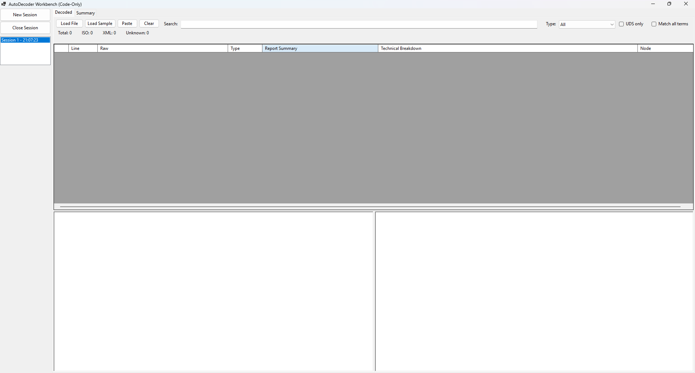
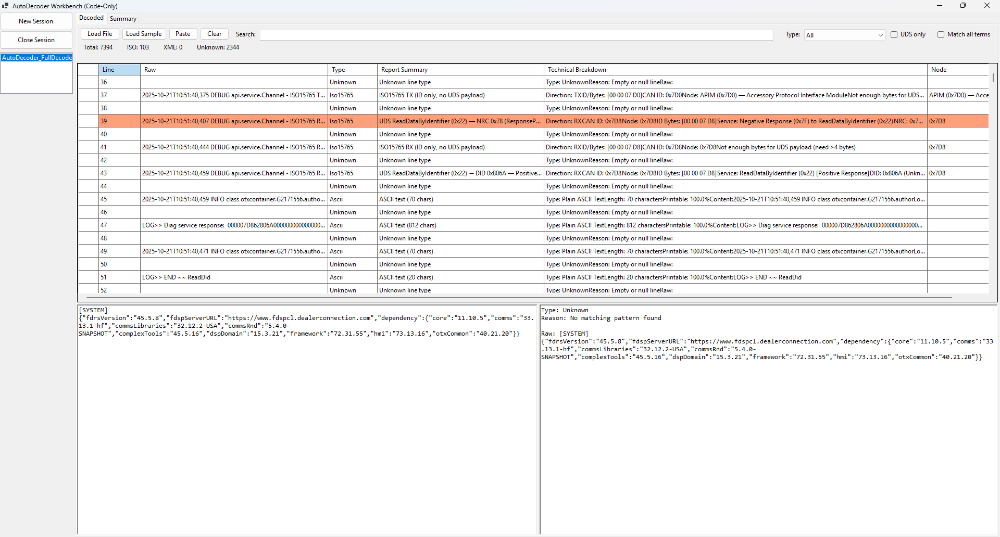
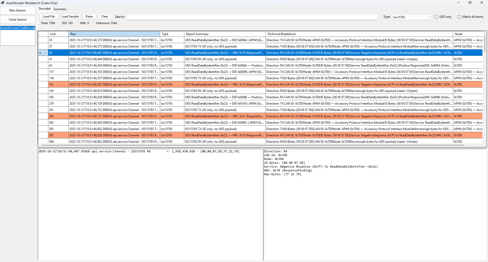

# AutoDecoder – Automotive Log Line Decoder

AutoDecoder is a C# WinForms application designed to decode, classify, and analyze automotive diagnostic log files using Object-Oriented Programming principles and layered architecture.

This tool demonstrates protocol decoding (UDS / ISO-TP), structured parsing, inheritance-based modeling, and stable UI rendering for large diagnostic datasets.

---

## Overview

Modern automotive diagnostic logs may contain:

- ISO 15765 (CAN transport protocol)
- UDS (Unified Diagnostic Services – ISO 14229)
- XML DID responses
- Raw hex payloads
- ASCII debug output
- Negative Response Codes (NRCs)

AutoDecoder processes each line into structured objects and provides:

- Line-by-line decoding
- Protocol classification
- ISO-TP message reconstruction
- UDS request/response interpretation
- Summary statistics (NRC / DID counts)
- Stable DataGridView rendering with safe column ordering

---

## Architecture

```

AutoDecoder.Gui        → WinForms UI (Presentation Layer)
AutoDecoder.Models     → Domain models (OOP core)
AutoDecoder.Protocols  → Protocol parsing and decoding logic

```

### AutoDecoder.Models

Contains the core OOP architecture.

**Key Concepts Demonstrated:**

- Inheritance (abstract base class `LogLine`)
- Encapsulation (private backing fields with read-only accessors)
- Polymorphism (`ParseAndDecode()` overridden per derived type)
- Abstraction (abstract `Type` property)

**Derived Types:**

- Iso15765Line
- XmlLine
- HexLine
- AsciiLine
- UnknownLine

Each log entry becomes a strongly typed object.

---

### AutoDecoder.Protocols

Contains deterministic decoding logic.

**Components:**

- LineClassifier
- Iso15765Decoder
- UdsDecoder
- XmlDidDecoder
- HexTools
- DecodeTables

#### Supported Protocol Patterns

**ISO15765 Example**
```

ISO15765 TX -> [00,00,07,D0,22,80,6A]
ISO15765 RX <- [00,00,07,D8,7F,22,78]

```

**UDS Negative Response**
```

7F 22 78

```
→ Negative Response to ReadDataByIdentifier  
→ NRC 0x78 (Response Pending)

**UDS Positive Response**
```

62 F1 88 ...

````
→ Positive Response  
→ DID 0xF188 (Strategy)

**XML DID Example**
```xml
<ns3:didValue didValue="F188"><ns3:Response>4D59...</ns3:Response></ns3:didValue>
````

**Hex Example**

```
[48,65,6C,6C,6F]
DEADBEEF01234567
```

---

### AutoDecoder.Gui

WinForms interface with:

* Load File
* Load Sample
* Paste Log
* Clear
* Filter by type
* UDS-only filter
* Search with token support
* Raw vs Decoded split view
* Multi-session support (MaxSessions = 5)

Safe grid logic includes:

* Timestamp columns removed
* Sequential DisplayIndex ordering
* Post-binding column sizing
* Splitter distance clamping
* Null-safe rendering

---

## Screenshots

### Main Decoded View

<p align="center">
  
</p>

---

### Raw vs Decoded Split

<p align="center">
  
</p>

---

### Summary View (NRC / DID)

<p align="center">
  
</p>

---

## Supported UDS Services

* 0x10 DiagnosticSessionControl
* 0x11 ECUReset
* 0x22 ReadDataByIdentifier
* 0x27 SecurityAccess
* 0x2E WriteDataByIdentifier
* 0x31 RoutineControl
* 0x3E TesterPresent
* 0x7F NegativeResponse

---

## Supported NRCs

* 0x10 GeneralReject
* 0x11 ServiceNotSupported
* 0x13 IncorrectMessageLength
* 0x22 ConditionsNotCorrect
* 0x31 RequestOutOfRange
* 0x33 SecurityAccessDenied
* 0x35 InvalidKey
* 0x36 ExceededAttempts
* 0x37 RequiredTimeDelayNotExpired
* 0x78 ResponsePending

---

## Supported DIDs

* 0xF188 Strategy
* 0xF110 PartII_Spec
* 0xF111 CoreAssembly
* 0xF113 Assembly
* 0xF124 Calibration
* 0xDE00 DirectConfiguration

---

## Technical Details

Target Framework: .NET 10.0
Language: C# (nullable enabled)
Architecture: 3-tier separation (Models / Protocols / GUI)
Design Pattern: Layered architecture with protocol abstraction

---

## OOP Requirements Demonstrated

✔ 10+ objects instantiated during runtime
✔ Abstract base class with derived implementations
✔ Encapsulation of raw log data
✔ Polymorphic decoding behavior
✔ Structured exception handling
✔ Deterministic decoding logic

---

## Version

Current Version: v0.4.0
Status: Active Development

---

## Roadmap

* CAN ID flow tracking
* UDS conversation grouping
* NRC highlighting
* Exportable findings report
* Large log performance optimization
* DoIP support

---

## Engineering Direction

This project is evolving toward:

* Automotive cybersecurity log triage
* ECU communication flow analysis
* OTA update log interpretation
* Reverse engineering support tooling
* Secure vehicle diagnostics analysis


